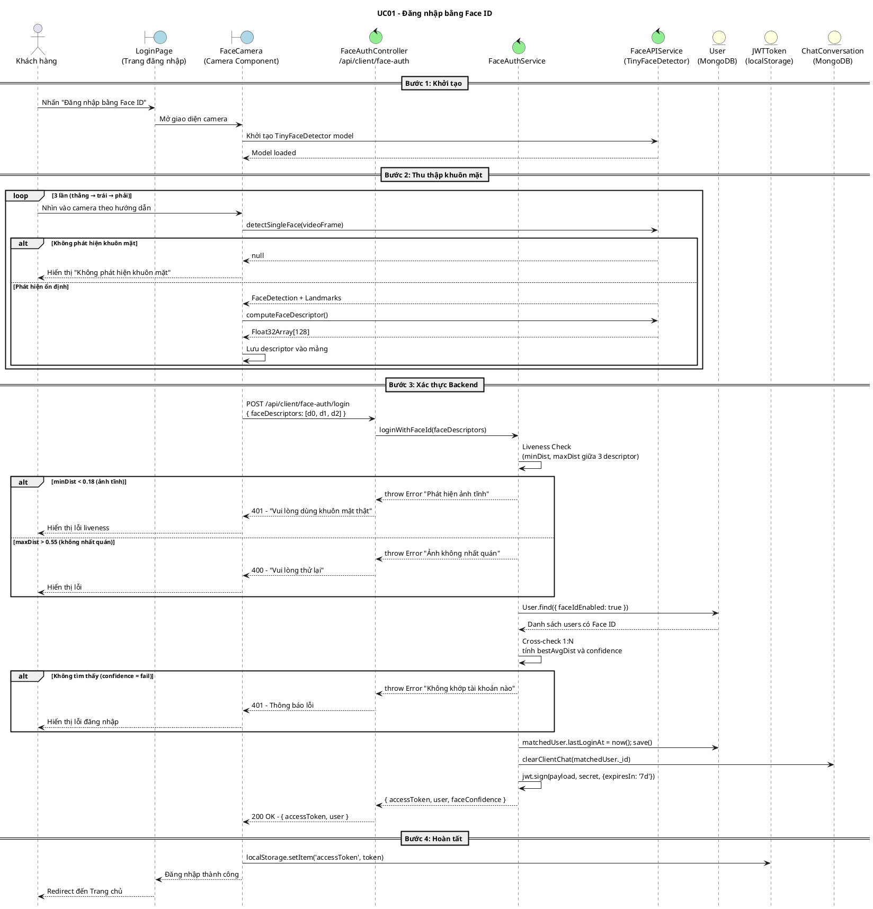
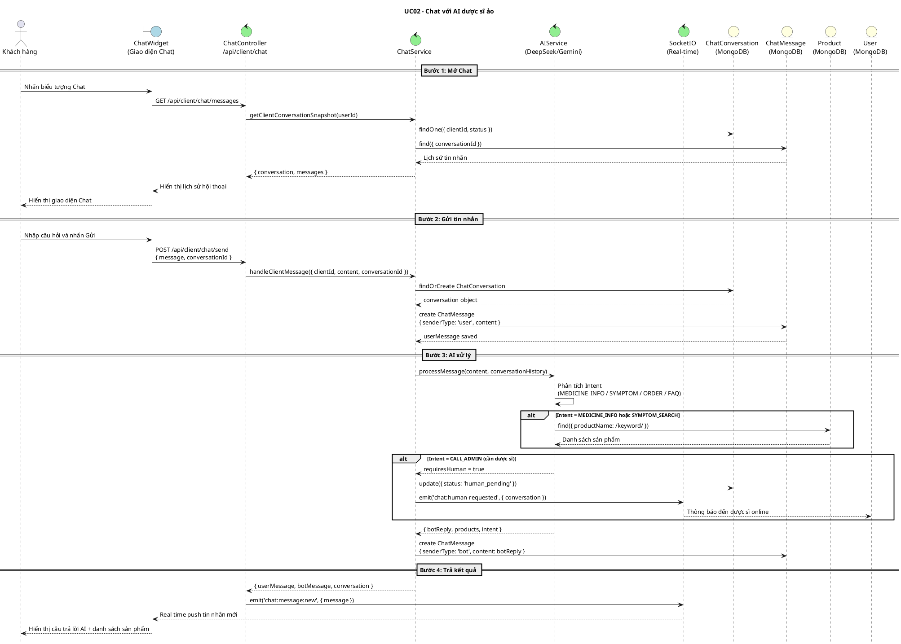
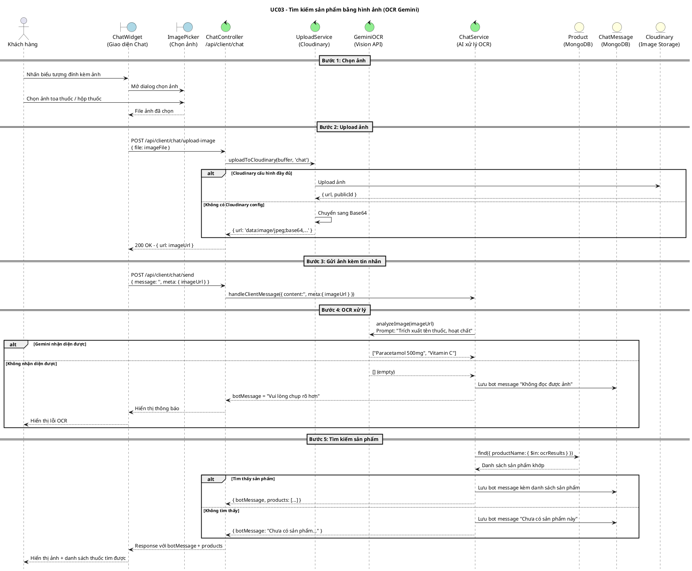
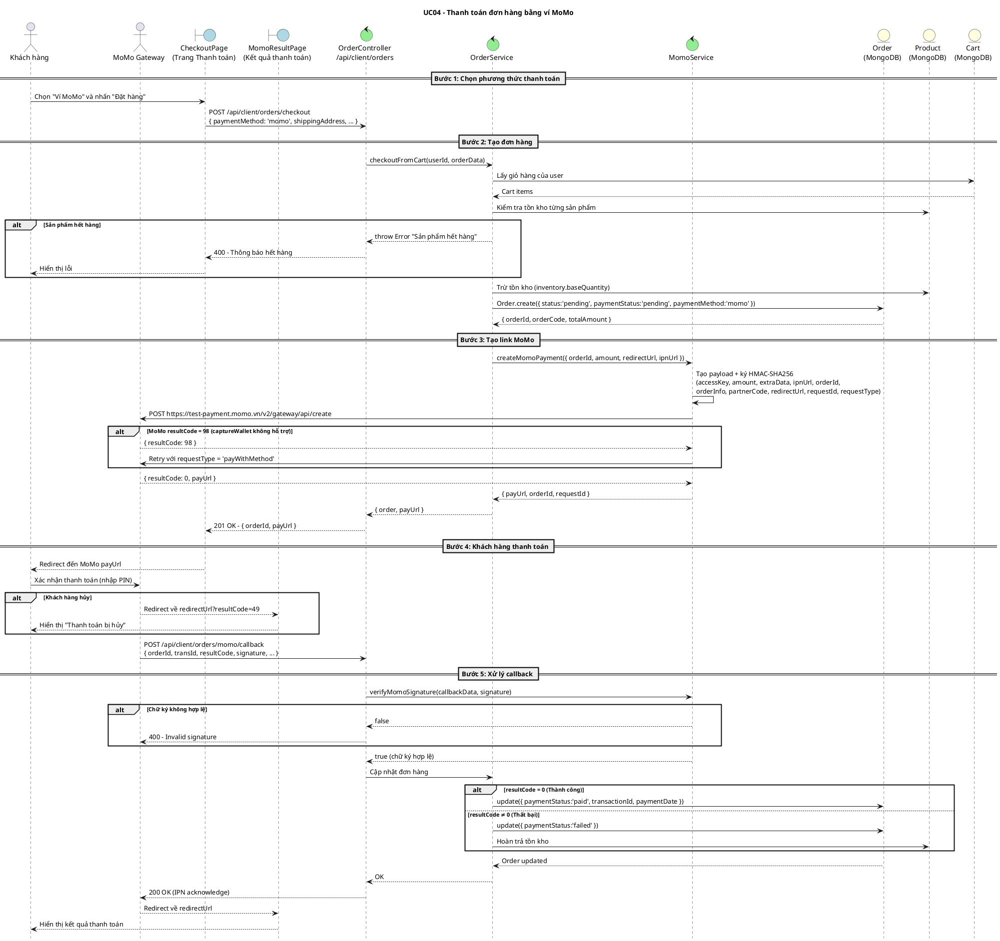
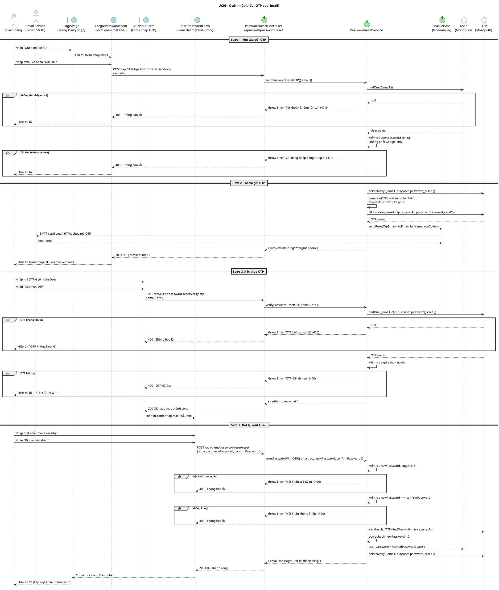

# Sequence Diagrams – 5 Use Cases (PlantUML)
# Phân biệt rõ Actor: Boundary | Controller | Entity

---

## 1. Sequence Diagram – Đăng nhập bằng Face ID

---

## 2. Sequence Diagram – Chat với AI

---

## 3. Sequence Diagram – Tìm kiếm bằng hình ảnh (OCR Gemini)

---

## 4. Sequence Diagram – Thanh toán bằng MoMo

---

## 5. Sequence Diagram – Quên mật khẩu (OTP Email)

