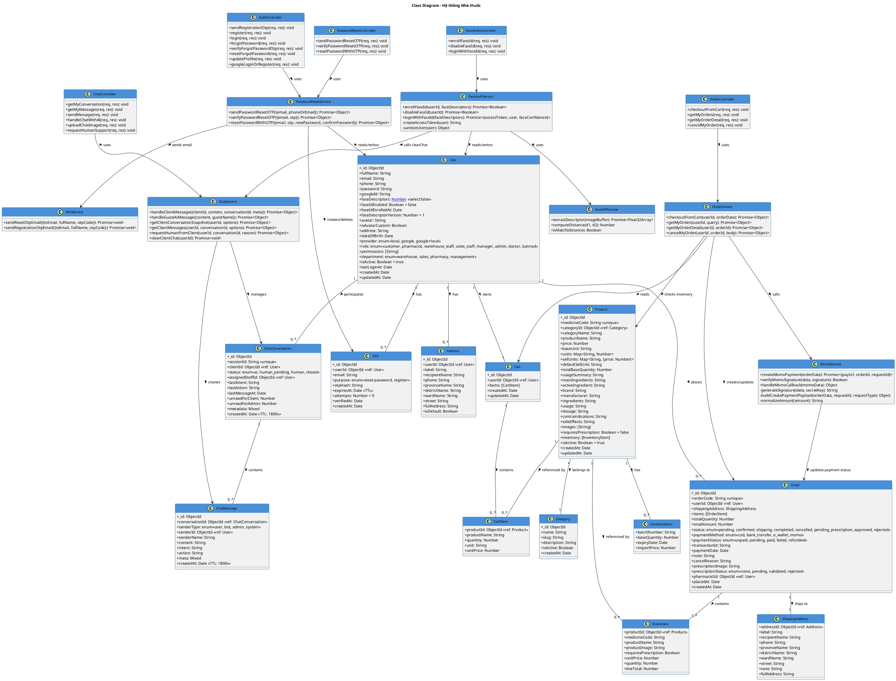

# Sơ đồ Class Diagram – Project Pharmacy

```plantuml
@startuml ClassDiagram_ProjectPharmacy
title Class Diagram – Hệ thống Nhà thuốc

skinparam classAttributeIconSize 0
skinparam classFontSize 12
skinparam classHeaderBackgroundColor #4A90D9
skinparam classHeaderFontColor #FFFFFF
skinparam classBorderColor #2C5F8A

' ============================================================
' ENTITY CLASSES (MongoDB Models)
' ============================================================

class User {
    +_id: ObjectId
    +fullName: String
    +email: String
    +phone: String
    +password: String
    +googleId: String
    +faceDescriptors: [[Number]] <<select:false>>
    +faceIdEnabled: Boolean = false
    +faceIdEnrolledAt: Date
    +faceDescriptorVersion: Number = 1
    +avatar: String
    +isAvatarCustom: Boolean
    +address: String
    +dateOfBirth: Date
    +provider: enum<<local, google, google+local>>
    +role: enum<<customer, pharmacist, warehouse_staff, sales_staff, manager, admin, doctor, banned>>
    +permissions: [String]
    +department: enum<<warehouse, sales, pharmacy, management>>
    +isActive: Boolean = true
    +lastLoginAt: Date
    +createdAt: Date
    +updatedAt: Date
}

class OTP {
    +_id: ObjectId
    +userId: ObjectId <<ref: User>>
    +email: String
    +purpose: enum<<reset-password, register>>
    +otpHash: String
    +expiresAt: Date <<TTL>>
    +attempts: Number = 0
    +verifiedAt: Date
    +createdAt: Date
}

class Product {
    +_id: ObjectId
    +medicineCode: String <<unique>>
    +categoryId: ObjectId <<ref: Category>>
    +categoryName: String
    +productName: String
    +price: Number
    +baseUnit: String
    +units: Map<String, Number>
    +sellUnits: Map<String, {price: Number}>
    +defaultSellUnit: String
    +totalBaseQuantity: Number
    +usageSummary: String
    +mainIngredients: String
    +activeIngredient: String
    +brand: String
    +manufacturer: String
    +ingredients: String
    +usage: String
    +dosage: String
    +contraindications: String
    +sideEffects: String
    +images: [String]
    +requiresPrescription: Boolean = false
    +inventory: [InventoryItem]
    +isActive: Boolean = true
    +createdAt: Date
    +updatedAt: Date
}

class InventoryItem {
    +batchNumber: String
    +baseQuantity: Number
    +expiryDate: Date
    +importPrice: Number
}

class Category {
    +_id: ObjectId
    +name: String
    +slug: String
    +description: String
    +isActive: Boolean
    +createdAt: Date
}

class Order {
    +_id: ObjectId
    +orderCode: String <<unique>>
    +userId: ObjectId <<ref: User>>
    +shippingAddress: ShippingAddress
    +items: [OrderItem]
    +totalQuantity: Number
    +totalAmount: Number
    +status: enum<<pending, confirmed, shipping, completed, cancelled, pending_prescription, approved, rejected>>
    +paymentMethod: enum<<cod, bank_transfer, e_wallet, momo>>
    +paymentStatus: enum<<unpaid, pending, paid, failed, refunded>>
    +transactionId: String
    +paymentDate: Date
    +note: String
    +cancelReason: String
    +prescriptionImage: String
    +prescriptionStatus: enum<<none, pending, validated, rejected>>
    +pharmacistId: ObjectId <<ref: User>>
    +placedAt: Date
    +createdAt: Date
}

class OrderItem {
    +productId: ObjectId <<ref: Product>>
    +medicineCode: String
    +productName: String
    +productImage: String
    +requiresPrescription: Boolean
    +unitPrice: Number
    +quantity: Number
    +lineTotal: Number
}

class ShippingAddress {
    +addressId: ObjectId <<ref: Address>>
    +label: String
    +recipientName: String
    +phone: String
    +provinceName: String
    +districtName: String
    +wardName: String
    +street: String
    +note: String
    +fullAddress: String
}

class Cart {
    +_id: ObjectId
    +userId: ObjectId <<ref: User>>
    +items: [CartItem]
    +createdAt: Date
    +updatedAt: Date
}

class CartItem {
    +productId: ObjectId <<ref: Product>>
    +productName: String
    +quantity: Number
    +unit: String
    +unitPrice: Number
}

class ChatConversation {
    +_id: ObjectId
    +sessionId: String <<unique>>
    +clientId: ObjectId <<ref: User>>
    +status: enum<<ai, human_pending, human, closed>>
    +assignedStaffId: ObjectId <<ref: User>>
    +lastIntent: String
    +lastAction: String
    +lastMessageAt: Date
    +unreadForClient: Number
    +unreadForAdmin: Number
    +metadata: Mixed
    +createdAt: Date <<TTL: 1800s>>
}

class ChatMessage {
    +_id: ObjectId
    +conversationId: ObjectId <<ref: ChatConversation>>
    +senderType: enum<<user, bot, admin, system>>
    +senderId: ObjectId <<ref: User>>
    +senderName: String
    +content: String
    +intent: String
    +action: String
    +meta: Mixed
    +createdAt: Date <<TTL: 1800s>>
}

class Address {
    +_id: ObjectId
    +userId: ObjectId <<ref: User>>
    +label: String
    +recipientName: String
    +phone: String
    +provinceName: String
    +districtName: String
    +wardName: String
    +street: String
    +fullAddress: String
    +isDefault: Boolean
}

' ============================================================
' SERVICE CLASSES
' ============================================================

class FaceAuthService {
    +enrollFaceId(userId, faceDescriptors): Promise<Boolean>
    +disableFaceId(userId): Promise<Boolean>
    +loginWithFaceId(faceDescriptors): Promise<{accessToken, user, faceConfidence}>
    -createAccessToken(user): String
    -sanitizeUser(user): Object
}

class PasswordResetService {
    +sendPasswordResetOTP({email, phoneOrEmail}): Promise<Object>
    +verifyPasswordResetOTP({email, otp}): Promise<Object>
    +resetPasswordWithOTP({email, otp, newPassword, confirmPassword}): Promise<Object>
}

class ChatService {
    +handleClientMessage({clientId, content, conversationId, meta}): Promise<Object>
    +handleGuestAiMessage({content, guestName}): Promise<Object>
    +getClientConversationSnapshot(userId, options): Promise<Object>
    +getClientMessages(userId, conversationId, options): Promise<Object>
    +requestHumanFromClient(userId, conversationId, reason): Promise<Object>
    +clearClientChat(userId): Promise<void>
}

class MomoService {
    +createMomoPayment(orderData): Promise<{payUrl, orderId, requestId}>
    +verifyMomoSignature(data, signature): Boolean
    +handleMomoCallback(momoData): Object
    -generateSignature(data, secretKey): String
    -buildCreatePaymentPayload(orderData, requestId, requestType): Object
    -normalizeAmount(amount): String
}

class OrderService {
    +checkoutFromCart(userId, orderData): Promise<Object>
    +getMyOrders(userId, query): Promise<Object>
    +getMyOrderDetail(userId, orderId): Promise<Object>
    +cancelMyOrder(userId, orderId, body): Promise<Object>
}

class MailService {
    +sendResetOtpEmail({toEmail, fullName, otpCode}): Promise<void>
    +sendRegistrationOtpEmail({toEmail, fullName, otpCode}): Promise<void>
}

class FaceAPIService {
    +extractDescriptor(imageBuffer): Promise<Float32Array>
    +computeDistance(d1, d2): Number
    +isMatch(distance): Boolean
}

' ============================================================
' CONTROLLER CLASSES
' ============================================================

class FaceAuthController {
    +enrollFaceId(req, res): void
    +disableFaceId(req, res): void
    +loginWithFaceId(req, res): void
}

class AuthController {
    +sendRegistrationOtp(req, res): void
    +register(req, res): void
    +login(req, res): void
    +forgotPassword(req, res): void
    +verifyForgotPasswordOtp(req, res): void
    +resetForgotPassword(req, res): void
    +updateProfile(req, res): void
    +googleLoginOrRegister(req, res): void
}

class PasswordResetController {
    +sendPasswordResetOTP(req, res): void
    +verifyPasswordResetOTP(req, res): void
    +resetPasswordWithOTP(req, res): void
}

class ChatController {
    +getMyConversation(req, res): void
    +getMyMessages(req, res): void
    +sendMessage(req, res): void
    +handleChatWithAI(req, res): void
    +uploadChatImage(req, res): void
    +requestHumanSupport(req, res): void
}

class OrderController {
    +checkoutFromCart(req, res): void
    +getMyOrders(req, res): void
    +getMyOrderDetail(req, res): void
    +cancelMyOrder(req, res): void
}

' ============================================================
' RELATIONSHIPS
' ============================================================

' Entity relationships
User "1" -- "0..*" OTP : has >
User "1" -- "0..*" Order : places >
User "1" -- "1" Cart : owns >
User "1" -- "0..*" Address : has >
User "1" -- "0..*" ChatConversation : participates >
ChatConversation "1" -- "0..*" ChatMessage : contains >
Order "1" -- "1..*" OrderItem : contains >
Order "1" -- "1" ShippingAddress : ships to >
Cart "1" -- "0..*" CartItem : contains >
Product "1" -- "0..*" OrderItem : referenced by >
Product "1" -- "0..*" CartItem : referenced by >
Product "1" -- "0..*" InventoryItem : has >
Product "*" -- "1" Category : belongs to >

' Controller -> Service
FaceAuthController --> FaceAuthService : uses >
AuthController --> PasswordResetService : uses >
PasswordResetController --> PasswordResetService : uses >
ChatController --> ChatService : uses >
OrderController --> OrderService : uses >

' Service -> Entity
FaceAuthService --> User : reads/writes >
FaceAuthService --> FaceAPIService : uses >
FaceAuthService --> ChatService : calls clearChat >
PasswordResetService --> User : reads/writes >
PasswordResetService --> OTP : creates/deletes >
PasswordResetService --> MailService : sends email >
ChatService --> ChatConversation : manages >
ChatService --> ChatMessage : creates >
OrderService --> Order : creates/updates >
OrderService --> Cart : reads >
OrderService --> Product : checks inventory >
OrderService --> MomoService : calls >
MomoService --> Order : updates payment status >

@enduml
```
