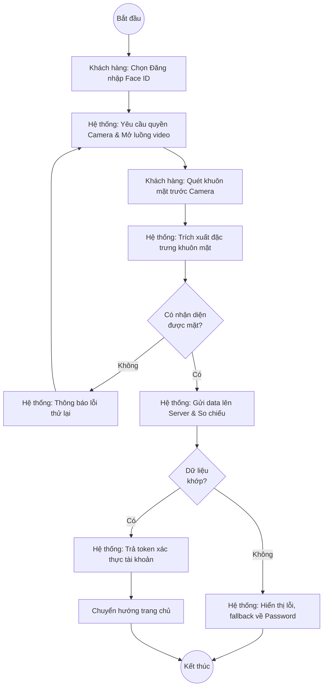
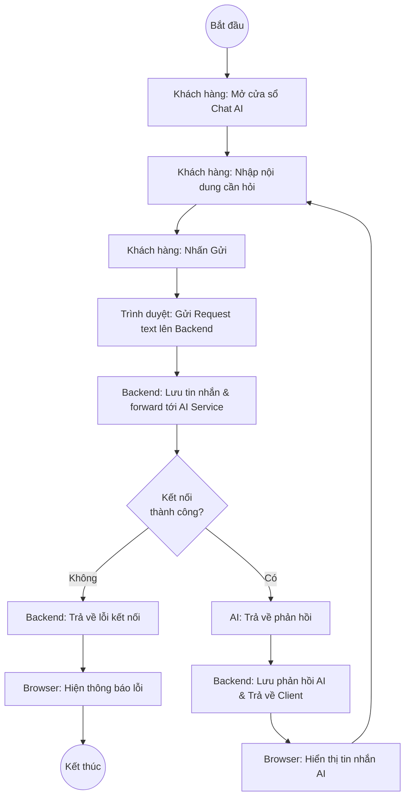
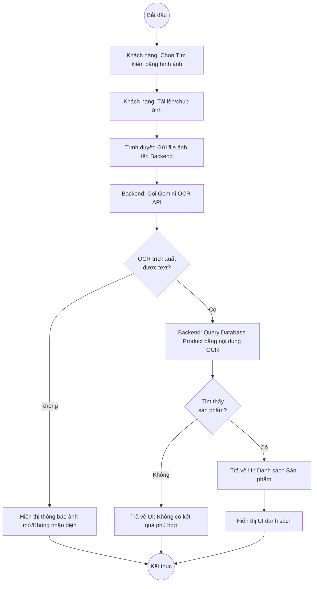
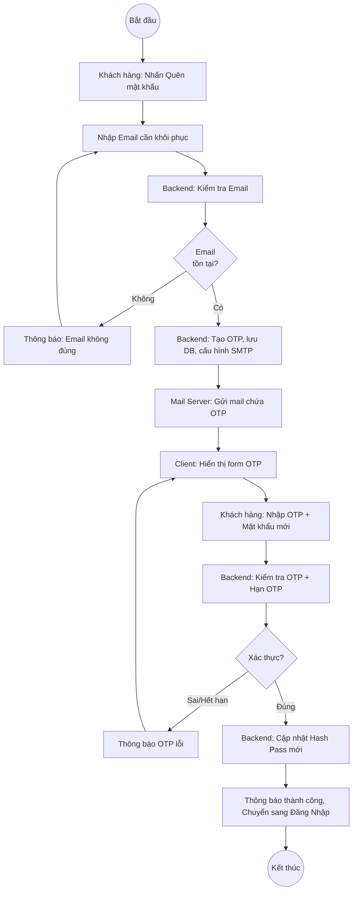
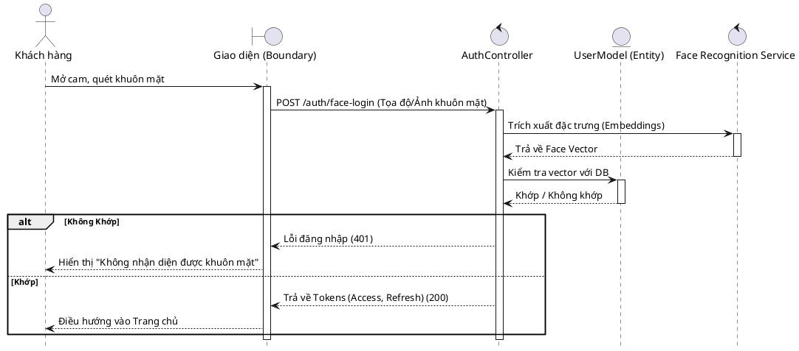
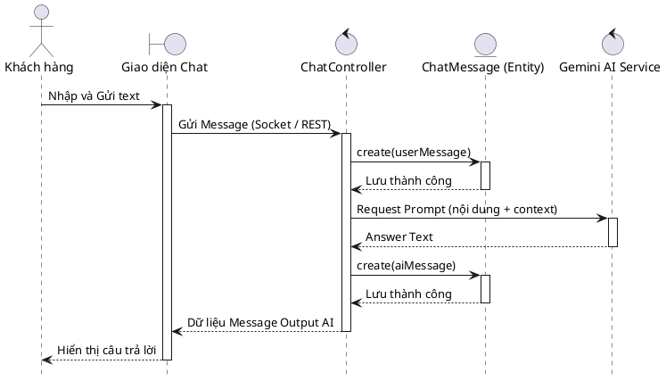
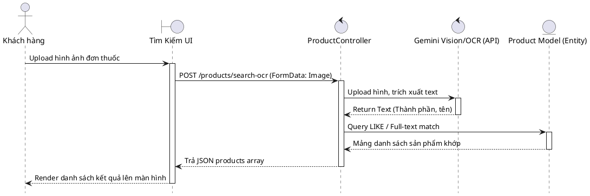
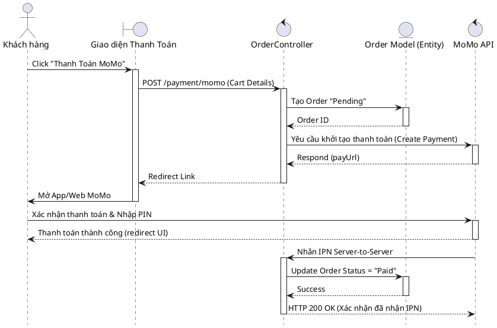
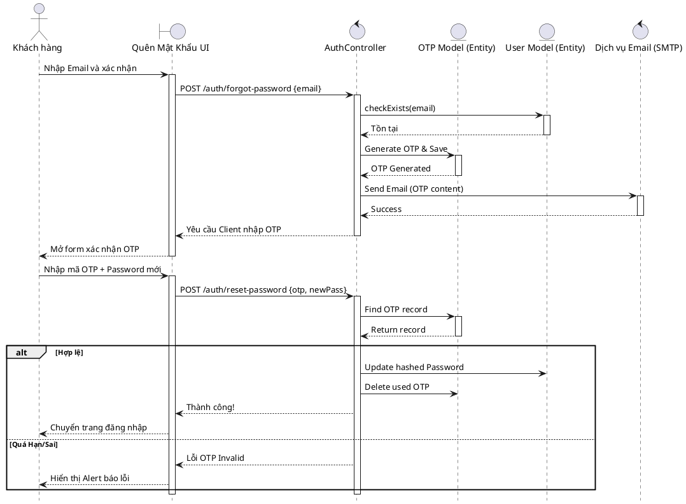
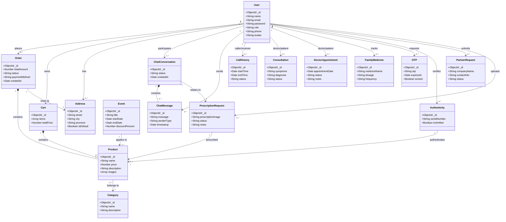

# TÀI LIỆU THIẾT KẾ VÀ ĐẶC TẢ HỆ THỐNG - PROJECT PHARMACY

## 1. ĐẶC TẢ USE CASE (Use Case Specification)

### 1.1. Use case Đăng nhập bằng Face ID

| Tên UC | Đăng nhập bằng Face ID |
| :--- | :--- |
| **Mô tả ngắn gọn** | Chức năng giúp người dùng (khách hàng/admin) đăng nhập vào hệ thống thông qua nhận diện khuôn mặt thay vì dùng mật khẩu. |
| **Actor chính** | Người dùng (Khách hàng) |
| **Actor phụ** | Không |
| **Tiền điều kiện** | Hệ thống có quyền truy cập camera thiết bị. Người dùng đã đăng ký khuôn mặt trên hệ thống. |
| **Hậu điều kiện** | Đăng nhập thành công và chuyển hướng đến trang chủ. |
| **Luồng sự kiện chính** | **Khách hàng** | **Hệ thống** |
| | 1. Nhấn nút "Đăng nhập bằng Face ID" | 2. Hệ thống yêu cầu quyền truy cập camera và bật luồng video. |
| | 3. Quét khuôn mặt trước camera | 4. Hệ thống trích xuất đặc trưng khuôn mặt và gửi lên server. |
| | | 5. So sánh đặc trưng với dữ liệu khuôn mặt đã lưu. |
| | | 6. Trả về token đăng nhập và chuyển hướng sang trang chủ. |
| **Luồng sự kiện thay thế** | 4.1 Không tìm thấy khuôn mặt | 4.2 Hiển thị thông báo "Không nhận diện được khuôn mặt, vui lòng thử lại". |
| | 5.1 Khuôn mặt không khớp dữ liệu | 5.2 Thông báo "Khuôn mặt không khớp" và yêu cầu thử lại hoặc đăng nhập bằng mật khẩu. |

---

### 1.2. Use case Chat với AI

| Tên UC | Chat với AI |
| :--- | :--- |
| **Mô tả ngắn gọn** | Chức năng giúp khách hàng trò chuyện với trợ lý AI để hỏi đáp thông tin thuốc, tư vấn sức khỏe. |
| **Actor chính** | Khách hàng |
| **Actor phụ** | AI Engine |
| **Tiền điều kiện** | Khách hàng đã đăng nhập hoặc hệ thống cho phép chat khách (guest). |
| **Hậu điều kiện** | Lưu lịch sử chat, cung cấp câu trả lời hữu ích cho khách hàng. |
| **Luồng sự kiện chính** | **Khách hàng** | **Hệ thống** |
| | 1. Nhấn vào biểu tượng Chat và chọn "Chat với AI" | 2. Hệ thống mở cửa sổ giao diện Chat, tải tin nhắn chào mừng. |
| | 3. Nhập câu hỏi và nhấn Gửi | 4. Nhận đoạn chat, phân tích ngữ cảnh, gọi API đến AI Engine. |
| | | 5. AI Engine xử lý và trả về phản hồi thích hợp. |
| | | 6. Hệ thống hiển thị câu trả lời của AI lên màn hình chat và lưu `chatMessage`. |
| **Luồng sự kiện thay thế** | 5.1 Lỗi kết nối AI Engine | 5.2 Hệ thống thông báo "Hệ thống AI đang bận, vui lòng thử lại sau". |

---

### 1.3. Use case Tìm kiếm bằng hình ảnh (OCR)

| Tên UC | Tìm kiếm bằng hình ảnh (OCR API Gemini) |
| :--- | :--- |
| **Mô tả ngắn gọn** | Khách hàng tải ảnh đơn thuốc hoặc vỏ thuốc lên, hệ thống dùng OCR để đọc chữ và đối chiếu tìm kiếm sản phẩm. |
| **Actor chính** | Khách hàng |
| **Actor phụ** | Gemini OCR API |
| **Tiền điều kiện** | Thiết bị khách hàng có ảnh hoặc thiết bị có camera để chụp. |
| **Hậu điều kiện** | Trả về danh sách sản phẩm khớp với văn bản trích xuất từ hình ảnh. |
| **Luồng sự kiện chính** | **Khách hàng** | **Hệ thống** |
| | 1. Chọn chức năng "Tìm kiếm bằng hình ảnh" | 2. Yêu cầu tải lên hình ảnh hoặc chụp ảnh mới. |
| | 3. Chọn/chụp ảnh và xác nhận | 4. Hệ thống tải ảnh lên server, gọi API Gemini OCR. |
| | | 5. Nhận kết quả text (tên thuốc, thành phần) từ API. |
| | | 6. Hệ thống query DB `product.model` để tìm các sản phẩm matching với text. |
| | | 7. Hiển thị danh sách sản phẩm kết quả cho người dùng. |
| **Luồng sự kiện thay thế** | 5.1 Hình ảnh mờ, không trích xuất được chữ | 5.2 Hiển thị thông báo "Không nhận diện được chữ thập trên ảnh, vui lòng thử lại ảnh nét hơn". |
| | 6.1 Không có sản phẩm nào khớp | 6.2 Thông báo "Không tìm thấy sản phẩm phù hợp với tìm kiếm". |

---

### 1.4. Use case Thanh toán bằng MoMo

| Tên UC | Thanh toán bằng MoMo |
| :--- | :--- |
| **Mô tả ngắn gọn** | Cho phép khách hàng thanh toán đơn hàng bằng ví điện tử MoMo. |
| **Actor chính** | Khách hàng |
| **Actor phụ** | MoMo Gateway |
| **Tiền điều kiện** | Khách hàng đã thêm sản phẩm vào giỏ hàng, đã nhập thông tin giao hàng và chọn phương thức thanh toán MoMo. |
| **Hậu điều kiện** | Đơn hàng chuyển sang trạng thái "Đã thanh toán" nếu giao dịch thành công. |
| **Luồng sự kiện chính** | **Khách hàng** | **Hệ thống** |
| | 1. Nhấn nút "Thanh toán giao dịch" | 2. Hệ thống kiểm tra giỏ hàng, tổng tiền, tạo Order với trạng thái "Pending". |
| | | 3. Gửi yêu cầu khởi tạo thanh toán tới MoMo Gateway. |
| | | 4. Nhận URL thanh toán và mã QR từ MoMo, điều hướng khách hàng. |
| | 5. Quét QR hoặc xác nhận trên ví MoMo | 6. Đợi IPN/Webhook từ MoMo phản hồi kết quả trả về server. |
| | | 7. Server nhận phản hồi thành công, cập nhật state đơn hàng sang "Paid". |
| | | 8. Chuyển hướng người dùng về trang "Thành công". |
| **Luồng sự kiện thay thế** | 6.1 Khách hàng huỷ thanh toán | 6.2 MoMo trả về trạng thái huỷ, hệ thống giữ trạng thái "Pending" hoặc "Cancelled" tuỳ logic. |
| | 6.3 Hết hạn thanh toán | 6.4 Cập nhật Order "Cancelled" và thông báo thanh toán thất bại. |

---

### 1.5. Use case Quên mật khẩu (Gửi OTP qua Email)

| Tên UC | Quên mật khẩu |
| :--- | :--- |
| **Mô tả ngắn gọn** | Khách hàng lấy lại quyền truy cập thẻ bằng cách sử dụng mã OTP gửi qua email. |
| **Actor chính** | Khách hàng |
| **Actor phụ** | Email Service (SMTP/SendGrid) |
| **Tiền điều kiện** | Khách hàng quên mật khẩu và có email đã đăng ký. |
| **Hậu điều kiện** | Mật khẩu tài khoản được cập nhật và đăng nhập lại bình thường. |
| **Luồng sự kiện chính** | **Khách hàng** | **Hệ thống** |
| | 1. Chọn "Quên mật khẩu" | 2. Hiển thị form yêu cầu nhập Email. |
| | 3. Nhập Email và nhấn Tiếp tục | 4. Kiểm tra Email có tồn tại trong CSDL `user`. |
| | | 5. Tạo mã OTP, lưu vào DB và gửi Email cho khách hàng. |
| | | 6. Hiển thị form nhập OTP & mật khẩu mới. |
| | 7. Nhập OTP và mật khẩu mới, nhấn Xác nhận | 8. Kiểm tra OTP có hợp lệ và còn hạn không. |
| | | 9. Mã hóa mật khẩu mới và cập nhật vô DB, hủy OTP cũ. |
| | | 10. Thông báo thành công và điều hướng sang Đăng nhập. |
| **Luồng sự kiện thay thế** | 4.1 Email Không tồn tại | 4.2 Thông báo "Email không chưa được đăng ký". |
| | 8.1 OTP sai hoặc quá hạn | 8.2 Hiển thị lỗi thông báo "Mã OTP không hợp lệ hoặc đã hết hạn". |

---

## 2. SƠ ĐỒ ACTIVITY (Activity Diagrams)

### 2.1. Đăng nhập bằng Face ID


### 2.2. Chat với AI


### 2.3. Tìm kiếm bằng hình ảnh (OCR)


### 2.4. Thanh toán bằng MoMo
```mermaid
flowchart TD
    A((Bắt đầu)) --> B[Khách hàng: Checkout & Chọn MoMo]
    B --> C[Backend: Tạo Order "Pending"]
    C --> D[Backend: Cấu hình payload request Send to MoMo Gateway]
    D --> E[MoMo: Trả về `payUrl`]
    E --> F[Client: Redirect sang trang thanh toán MoMo]
    F --> G[Khách hàng: Xác nhận thanh toán (App/Web)]
    G --> H{KH Thanh Toán?}
    H -- Hủy --> I[MoMo: Redirect về callback lỗi] --> J[Backend: Order Cancelled]
    H -- Thành Công --> K[MoMo: Gửi IPN/Webhook + Redirect callback]
    K --> L[Backend: Xác nhận chữ ký IPN]
    L --> M[Backend: Cập nhật Order "Paid"]
    M --> N[Client: Hiện trang thanh toán Thành công]
    J --> O((Kết thúc))
    N --> O

```

### 2.5. Quên mật khẩu


---

## 3. SƠ ĐỒ SEQUENCE (Sequence Diagrams)

### 3.1. Đăng nhập bằng Face ID


### 3.2. Chat với AI


### 3.3. Tìm kiếm bằng hình ảnh (OCR)


### 3.4. Thanh toán MoMo


### 3.5. Quên mật khẩu


---

## 4. SƠ ĐỒ LỚP (Class Diagram)

*Lưu ý: Đây là sơ đồ lớp Model (Entity) cho toàn bộ hệ thống dự án Project_Pharmacy.*



---
*Tài liệu được sinh tự động dựa trên mã nguồn Project_Pharmacy*
